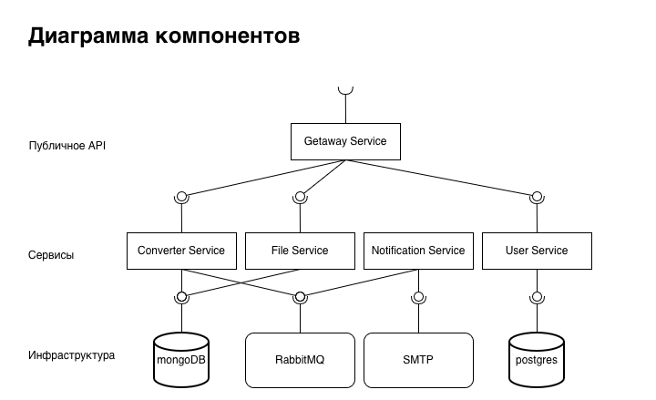
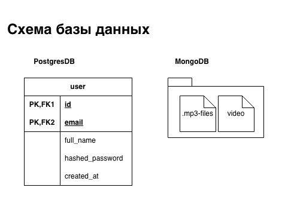
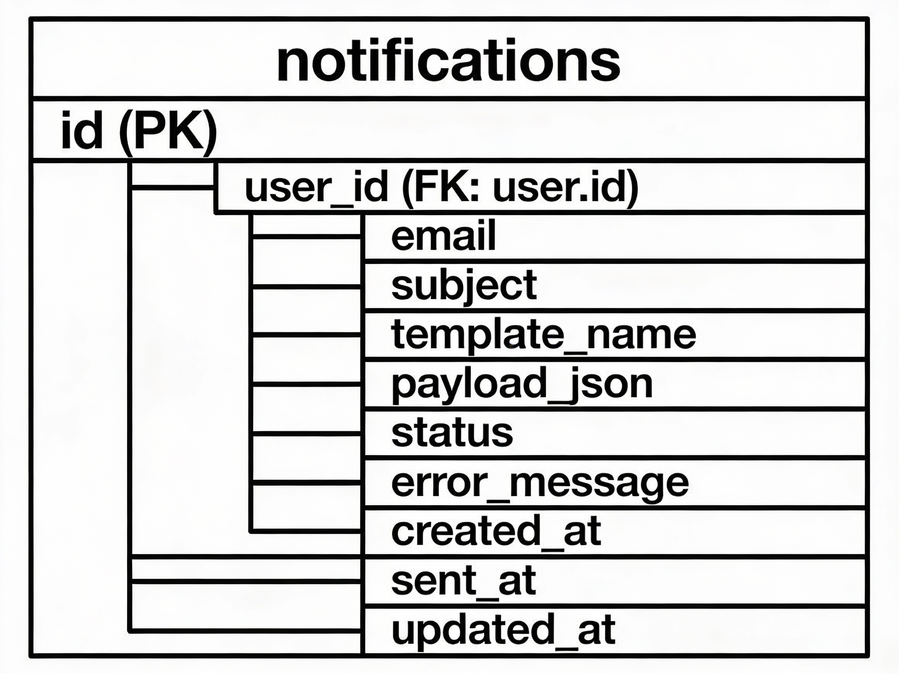
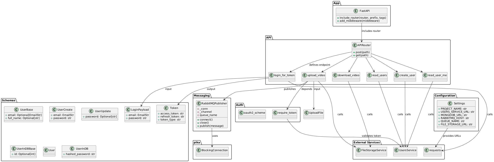
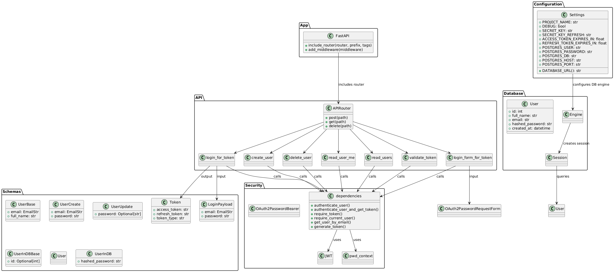
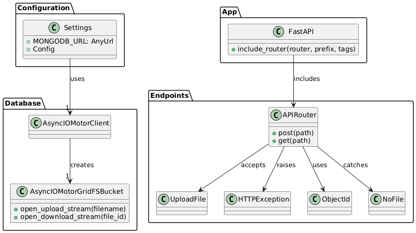
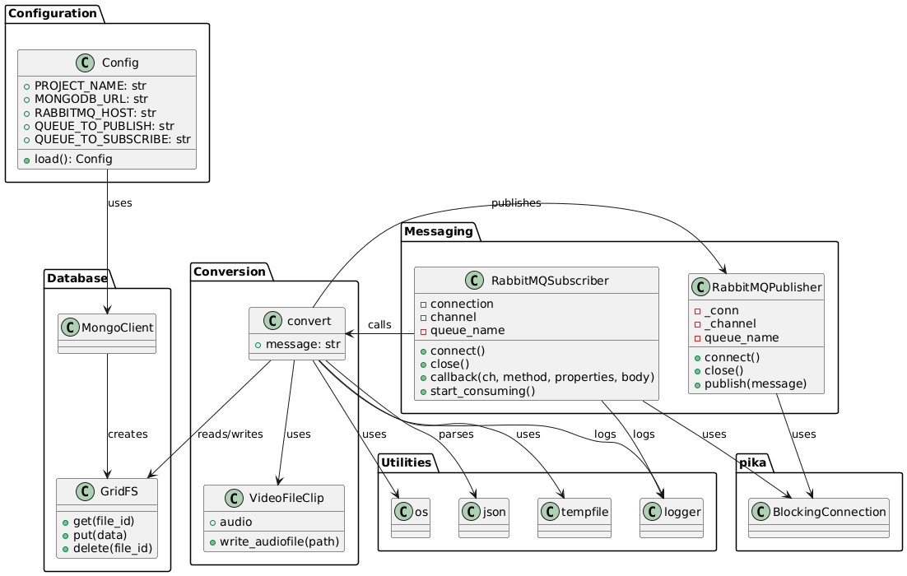
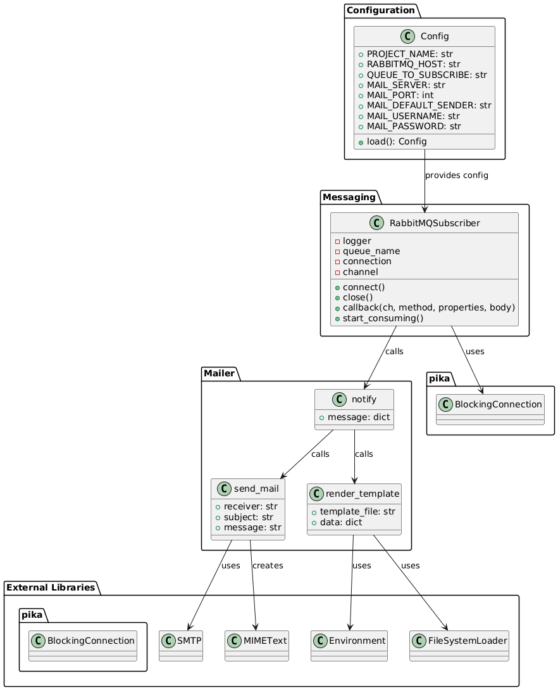

# Microservices Python

## Описание

**Microservices Python** — это проект, реализующий микросервисную архитектуру с использованием FastAPI, RabbitMQ, MySQL и MongoDB для конвертации видеофайлов в аудиоформат mp3 с последующей отправкой ссылки или идентификатора для скачивания результата на email пользователя. Система полностью асинхронна и ориентирована на масштабируемость и изоляцию логики между сервисами.

## Сервисы и архитектура

- **API Gateway**  
  Входная точка для клиента. Аутентификация, маршрутизация запросов, работа с файлами, публикация событий в очередь RabbitMQ.

- **Users-Service**  
  Регистрация и аутентификация пользователей. Хранение учетных данных в MySQL.

- **Converter-Service**  
  Получает сообщения о новых видео из RabbitMQ, скачивает видеофайл из MongoDB, конвертирует в mp3, загружает обратно в MongoDB и отправляет уведомление в очередь о готовности результата.

- **Notification-Service**  
  Слушает очередь уведомлений, по готовности mp3-файла получает идентификатор и отправляет письмо пользователю с инструкцией для скачивания.

- **Инфраструктурные компоненты**  
  - MongoDB — хранение видео и аудио файлов.
  - MySQL — хранение информации о пользователях.
  - RabbitMQ — связь между сервисами, очереди событий.
  - Email-сервис — отправка писем пользователям.

## Инструкция по запуску

1. Склонируйте репозиторий:
   ```
   git clone https://github.com/nahid111/microservices-python
   cd microservices-python
   ```

2. Подготовьте файл окружения `.env` на основе `example.env`.

3. Запустите все сервисы через Docker Compose:
   ```
   docker compose up
   ```
   Или в фоне:
   ```
   docker compose up -d
   ```

4. Документация API будет доступна по адресу  
   `http://0.0.0.0:5000/docs`

5. Для остановки и очистки:
   ```
   docker compose down -v
   sudo rm -rf volMongo/ volMysql/ volRabbit/
   ```

## Визуализация

### Диаграмма компонентов

### Схема БД


### Диаграммы классов микросервисов
#### Getaway Service

#### User Service

#### File Service

#### Convertation Service

#### Notification Service



## Пример рабочего процесса

1. Пользователь регистрируется и авторизуется через API Gateway.
2. Через Gateway загружает видеофайл (JWT обязателен).
3. Gateway сохраняет видео в MongoDB и публикует событие в очередь.
4. Converter-Service конвертирует файл и публикует новый идентификатор обратно в очередь.
5. Notification-Service отправляет email клиенту.
6. Пользователь скачивает готовый mp3 через Gateway, предоставив JWT и идентификатор.

## Требования

- Docker и docker-compose
- Python 3.8+ (для локальной разработки)
- Аккаунт на DockerHub (если нужен деплой на Kubernetes)
- Внешние сервисы: email SMTP, если требуется отправка писем.

## Переменные окружения

Все настройки внешних подключений и секретов (пароли, адреса, ключи) задаются через `.env` файл на примере `example.env`.

## Документация и поддержка

Для полного описания ручек API — откройте Swagger по адресу выше.  
Общие вопросы и баги — через GitHub Issues или по указанным контактам.
